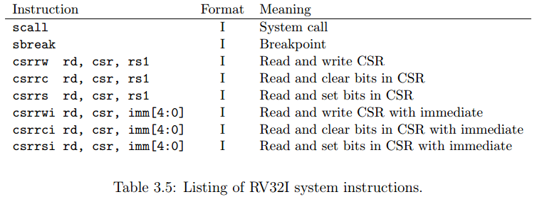

# 体系结构 lab1

by PB18111707 吕瑞

1. **描述执行一条 XOR 指令的过程（数据通路、控制信号等）。**

    ANS:

    控制信号：AluSrc1E 和 AluSrc2E 分别选择来自寄存器 rs1 和 rs2 的值，AluContrlE 选择 XOR（异或）操作，MemToRegW 选通 ResultW（ALU 输出），RegWrite 有效，LoadNpcE 选择 ALU 作为输出，其余信号无效。

    数据通路：在 ID 段得到两个寄存器的值，进入 EX 段经过 ALU 运算得到 XOR 之后的结果，经过一个选择器之后进入 MEM 阶段，随后直接进入 WB 段，再经过一个选择器之后，结果被写回到 rd 寄存器中。

    

2. **描述执行一条 BEQ 指令的过程·（数据通路、控制信号等）。**

    ANS：

    控制信号：BranchType 选择 BEQ，AluSrc1E 和 AluSrc2E 分别选择标号为 rs1 和 rs2 的寄存器值，ImmTypeD 选择 B-Type，其余控制信号无效。

    数据通路：在 ID 阶段，计算出分支转移的目的地址，进入 EX 阶段，BranchDecision 通过 Reg1 和 Reg2 的值计算产生 BranchE 信号，BrNPC 传输分支目标地址，写回 NPCGenerator。

    

3. **描述执行一条 LHU 指令的过程（数据通路、控制信号等）。**

    > **LHU** 指令类似 load 指令，但区别在于加载的数值位数不同，LHU 指令读取一个 16 位无符号数值，零扩展到 32 位。

    控制信号：AluSrc1E 选择 rs1 寄存器值，AluSrc2E 选择 ImmE，AluControlE 选择加法，RegWrite 有效（LHU），ImmType 为 I-type，MemToReg 选通 DataExt。

    数据通路：在 ID 段得到 rs1 和 Imm 的值，进入 EX 段经 ALU 计算目标数据的地址，再在 MEM 段，从 DataMemory 中取数据，在 WB 阶段，数据经过 DataExt 的扩展之后，写回寄存器。

    

4. **如果要实现 CSR 指令（csrrw，csrrs，csrrc，csrrwi，csrrsi，csrrci），设计图中还需要增加什么部件和数据通路？给出详细说明。**

    > 
    >
    > 这 6 条指令用于提供对 CSR 寄存器组的读写。CSR 即 control and status registers（控制状态寄存器组），提供一系列通用的工具给系统控制以及 I/O 使用:
    >
    > 1. CSRRW `csrrw rd, csr, rs1` - 拷贝一个 CSR 寄存器到一个通用寄存器 `rd` 当中，然后将 `rs1` 中的值覆盖给指定的 CSR 寄存器。
    > 2. CSRRC - 拷贝一个 CSR 寄存器到一个通用寄存器当中，然后根据 rs1 的位模式对指定的 CSR 寄存器进行清零（如果 rs1 的某一位为1，则 CSR 寄存器中该位置为 0。如果 rs1 的某一位为 0，则 CSR 寄存器中该位不变）。
    > 3. CSRRS - 拷贝一个 CSR 寄存器到一个通用寄存器当中，然后根据 rs1 的位模式对指定的 CSR 寄存器进行置位（如果 rs1 的某一位为 1，则 CSR 寄存器中该位置为 1。如果 rs1 的某一位为 0，则 CSR 寄存器中该位不变）。
    >
    > 需要注意的是，在上述的 CSR 寄存器中，将数据拷贝到通用寄存器的过程中需要对数据进行零扩展。
    >
    > CSRRWI、CSRRCI、CSRRSI 的功能与 CSRRW、CSRRC、CSRRS 一致，只是将 rs1 替换成了 5 位的零扩展的立即数。

    IF：无

    ID：完善立即数扩展模块，加入 CSR 扩展的格式支持；添加 CSR 寄存器文件；控制单元添加 CSR 的读写使能信号；将符号扩展之后的 CSR 送入 ID/EX 段寄存器。

    EX：在 AluSrc2E 数据选择器处加入 CSR；ALU 运算结果送入 EX/MEM 段

    MEM：结果输入到 MEM/WB 段

    WB：添加写回通用寄存器和 CSR 的线路。

    

5. **Verilog 如何实现立即数的扩展？**

    ANS：Risc-V 一共有五类立即数，verilog 需要分别对他们进行扩展。

    - Itype: out <= { {21{Ins[31]}}, Ins[30:20] }
    - Stype: out <= { {21{Ins[31]}}, Ins[20:25], Ins[11:8] Ins[11:7] }
    - Btype: out <= { {20{Ins[31]}}, Ins[7], Ins[30:25], Ins[11:8], {1’b0} }
    - Utype: out <= Ins[31:12] << 12
    - Jtype : out <= { {12{Ins[31]}}, Ins[19:12], Ins[20], Ins[30:21], {1’b0} }

    

6. **如何实现 Data Memory 的非字对齐的 Load 和 Store？**

    ANS：

    Load

    1. 将 DataMemory_addr 传入的地址设为 `AluOut[32:2],{2'b00}`，即将 AluOut 最后两位清零，得到所得的写地址字对齐之后的地址。

    2. 将清零前的低两位存入 LoadedBytesSelect ，在 DataExt 中选择数据。

    Store：寻址方式和 Load 相同。

    

7. **ALU 模块中，默认 wire 变量是有符号数还是无符号数？**

    ANS：默认 wire 变量是无符号数， wire signed 是有符号数。

    

8. **简述BranchE信号的作用。**

    ANS：

    BranchE 是分支控制信号，当 BranchE 为 1 时，表明分支将要跳转，此时 PC_In = PCF + BranchTarget

    

9. **NPC Generator 中对于不同跳转 target 的选择有没有优先级？**

    ANS：

    有，如果同时遇到 BranchE / JarlE 信号和 JalD 信号，应该前者的指令更早执行，即，他们在原来的指令顺序中更加靠前，所以优先级更高。

    

10. **Harzard 模块中，有哪几类冲突需要插入气泡，分别使流水线停顿几个周期？**

    ANS：

    一类，只有 load 指令 + 需要用到 load 的目标值的指令（写后读相关） 需要插入气泡。

    在有转发-旁路的情况下，只用插入一个气泡，使流水线停顿一个时钟周期即可。

     

11. **Harzard 模块中采用静态分支预测器，即默认不跳转，遇到 branch 指令时，如何控制 flush 和 stall 信号？**

    ANS:

    若 branch == 1 ，将 IF/ID 、ID/EX 段寄存器的 Stall 置 0、Flush 置 1，停止下两条指令的执行。

    

12. **0 号寄存器值始终为 0，是否会对 forward 的处理产生影响？**

    ANS：

    因为 0 号寄存器的值始终为零，所以在 EX/MEM/WB 段 将要给 0 号寄存器转发/赋值时，不能转发/赋值运算结果，而是转发/赋值 0（或者干脆不转发/赋值）。