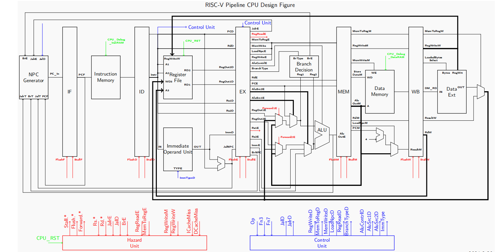
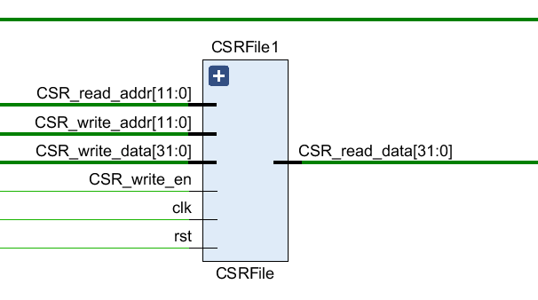
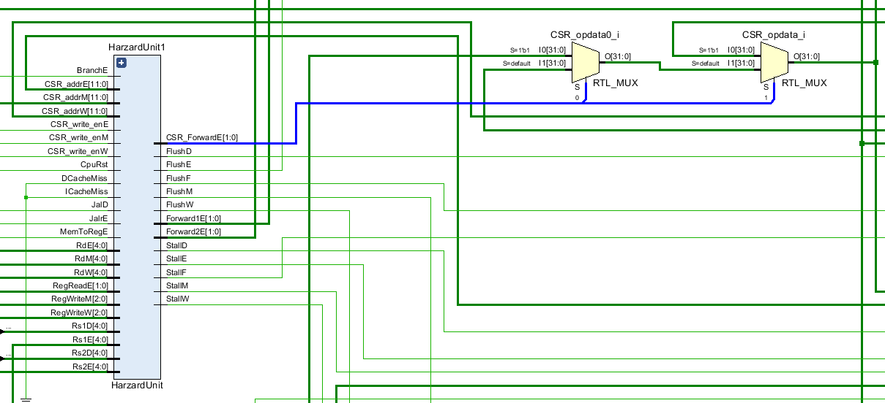
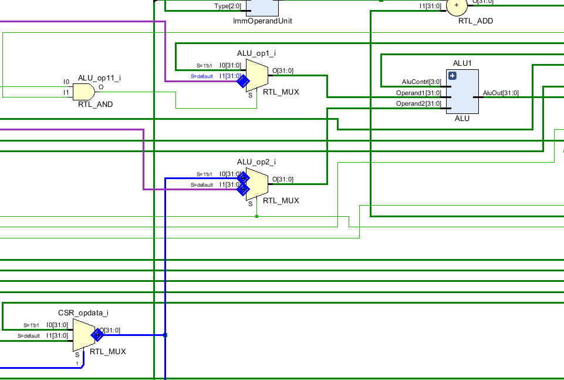
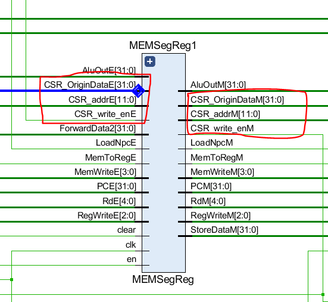
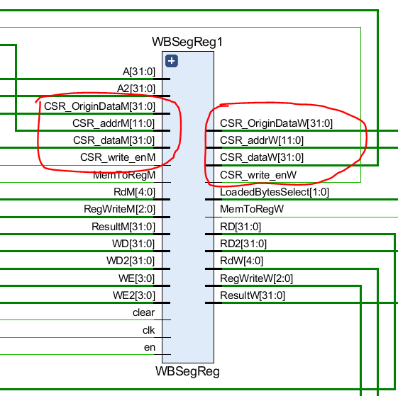
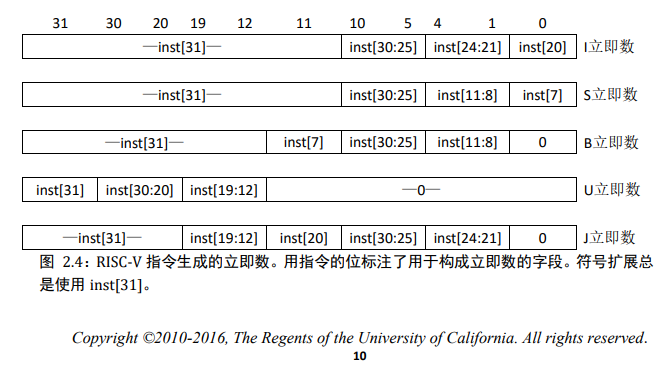

# ComputerArchitecture_Lab2

> PB18111707 吕瑞
>
> 2021/5/11

## 实验目标

- 用 verilog 实现 RSV32I 流水线 CPU。

- 需要设计旁路转发来处理数据相关。

- 需要支持特权指令。

    

## 实验环境

- 操作系统版本：Windows 10

- 处理器：Intel(R) Core(TM) i5-8250U CPU @ 1.60GHz   1.80 GHz

- Vivado 2019.1

    

## 实验内容

### 数据通路

1.0 版本（不支持 CSR 特权指令）



2.0 版本（**支持 CSR 特权指令**）


> 这 6 条指令用于提供对 CSR 寄存器组的读写。CSR 即 control and status registers（控制状态寄存器组），提供一系列通用的工具给系统控制以及 I/O 使用:
>
> 1. CSRRW `csrrw rd, csr, rs1` - 拷贝一个 CSR 寄存器到一个通用寄存器 `rd` 当中，然后将 `rs1` 中的值覆盖给指定的 CSR 寄存器。
>
> 2. CSRRC - 拷贝一个 CSR 寄存器到一个通用寄存器当中，然后根据 rs1 的位模式对指定的 CSR 寄存器进行清零（如果 rs1 的某一位为1，则 CSR 寄存器中该位置为 0。如果 rs1 的某一位为 0，则 CSR 寄存器中该位不变）。
>
> 3. CSRRS - 拷贝一个 CSR 寄存器到一个通用寄存器当中，然后根据 rs1 的位模式对指定的 CSR 寄存器进行置位（如果 rs1 的某一位为 1，则 CSR 寄存器中该位置为 1。如果 rs1 的某一位为 0，则 CSR 寄存器中该位不变）。
>
>     需要注意的是，在上述的 CSR 寄存器中，将数据拷贝到通用寄存器的过程中需要对数据进行零扩展。
>
>     CSRRWI、CSRRCI、CSRRSI 的功能与 CSRRW、CSRRC、CSRRS 一致，只是将 rs1 替换成了 5 位的零扩展的立即数。


**综上，我们需要在 1.0 版本的基础上，在流水线各个阶段补充以下器件和数据通路：**

- IF ：无需修改。

- ID：

    （1）ControlUnit 单元中增设两个 CSR 变量：

    ``` verilog
    // CSR signals
    .CSR_write_en(CSR_write_enD), // CSR 寄存器堆写使能
    .CSR_imm_or_reg(CSR_imm_or_regD) // CSR 指令参数选择信号
    ```

    

    （2）添加 CSRFile 作为 CSR 的寄存器堆：

    

    ``` verilog
    // CSR File
    CSRFile CSRFile1(
        // input 
        .clk(CPU_CLK),
        .rst(CPU_RST),
        .CSR_write_en(CSR_write_enD), // CSR 寄存器堆写使能信号
        .CSR_write_addr(CSR_addrW),
        .CSR_read_addr(CSR_addrD),
        .CSR_write_data(CSR_dataW),
        // output 
        .CSR_read_data(CSR_dataD)
    );
    ```

    （3）HazardUnit 增设 CSR 相关信号，用于处理 CSR 的数据相关：

    ​	

    ```verilog
    // CSR assign
    assign CSR_immD = {27'b0,Instr[19:15]};
    assign CSR_addrD = Instr[31:20];
    // CSR forwarding
    // CSR - original data forward
    assign RegWriteData_csr = (CSR_write_enW) ? CSR_OriginDataW: RegWriteData;
    assign AluOutM_csr = (CSR_write_enM) ? CSR_OriginDataM: AluOutM;
    // CSR - ALU operands forward
    assign ALU_op1 = (CSR_write_enE & CSR_imm_or_regE) ? (CSR_immE):(Operand1); // CSR_imm_or_reg = 1 选择立即数，= 0 选择 寄存器 rs1
    assign ALU_op2 = (CSR_write_enE) ? (CSR_opdata):(Operand2);
    assign CSR_opdata = CSR_ForwardE[1] ? (CSR_dataE):(CSR_ForwardE[0] ? AluOutM : CSR_dataW); //  上图中蓝色线表示的选择通路
    ```

    

- EX：

    （1）在 ALU 的参数选择中，增添对 CSR 的支持：`ALU_op1, ALU_op2`

    

    > 图中紫色数据线分别对应 `Operand1` 和 `Operand2`。 

    （2）BranchDecisionMaking 中增加对 CSR 数据的旁路支持：`RegWriteData_csr,AluOutM_csr `

    ```verilog
    // CSR - original data forward
    // assign RegWriteData_csr = (CSR_write_enW) ? CSR_OriginDataW: RegWriteData;
    // assign AluOutM_csr = (CSR_write_enM) ? CSR_OriginDataM: AluOutM;
    assign ForwardData1 = Forward1E[1]?(AluOutM_csr):( Forward1E[0]?RegWriteData_csr:RegOut1E );
    assign Operand1 = AluSrc1E?PCE:ForwardData1;
    assign ForwardData2 = Forward2E[1]?(AluOutM_csr):( Forward2E[0]?RegWriteData_csr:RegOut2E );
    assign Operand2 = AluSrc2E[1]?(ImmE):( AluSrc2E[0]?Rs2E:ForwardData2 );
    ```

- MEM：

    段间寄存器传递 CSR 信号量和需要写回 CSR/General 寄存器的地址和对应数据：

    

- WB ：

    段间寄存器段间寄存器传递 CSR 信号量和需要写回 CSR/General 寄存器的地址和对应数据：

    

> 注：
>
> 1. CSRFile 添加在 ID 阶段，旁路转发等操作类似普通指令。
> 2. CSR_OriginDataE/M/W 表示 ID 段的 CSR 指令中 csr 寄存器中的值，这个值需要一直保留到 WB 段，写回 RegFile。
> 3. CSR_OriginData 也需要考虑旁路转发。

### 重要模块分析

#### ALU

1. SLL、SRL、SRA 分别执行逻辑左移、逻辑右移、算术右移，被移位的操作数是寄存器 rs1，移位次数是寄存器 rs2 的低 5 位

2. 实现算数右移（保留符号位）

      一般认为 “>>>” 在 Verilog 里是算术右移指令，但实操中发现它有时会在右移时仍然补零，即使符号位为 1。这是因为 “>>>” 会先判断这个操作数是否有符号数。如果是无符号数，则补零，是有符号数，才会补符号位。而一般使用的 reg operand; 这种变量定义法默认所定义的变量为无符号数，因此只补零。

     解决办法是利用Verilog的内置函数 `$signed()`，将被移位的操作数转为有符号数类型。

    ```ini
    Result = ($signed(operandB)) >>> operandA;  //更正后
    ```

3. SLT 和 SLTU 分别执行符号数和无符号数的比较，如果 rs1<rs2，则将 1 写入 rd，否则写入 0。

4. LUI : Load Upper Imm U 

    ```ini
    LUI rd,imm
    #对应：`LUI: AluOut <= Operand2;
    ```

5. 阶段三中，需要增添对特权指令运算的支持：

    - CSRRW - 拷贝一个 CSR 寄存器到一个通用寄存器 `rd` 当中，然后将 `rs1` 中的值覆盖给指定的 CSR 寄存器。

        > ``CSR_OP1 : AluOut <= Operand1; // CSR 选择 Op1 中的值覆盖 csr 寄存器`

    - CSRRC - 拷贝一个 CSR 寄存器到一个通用寄存器当中，然后根据 rs1 的位模式对指定的 CSR 寄存器进行清零（如果 rs1 的某一位为1，则 CSR 寄存器中该位置为 0。如果 rs1 的某一位为 0，则 CSR 寄存器中该位不变）。

        > `CSR_CLEAR : AluOut <= ~Operand1 & Operand2; // CSR 清零`

    - CSRRS - 拷贝一个 CSR 寄存器到一个通用寄存器当中，然后根据 rs1 的位模式对指定的 CSR 寄存器进行置位（如果 rs1 的某一位为 1，则 CSR 寄存器中该位置为 1。如果 rs1 的某一位为 0，则 CSR 寄存器中该位不变）。

        > 直接调用 ALU 的 `OR` 操作即可。

#### BranchDecisionMaking

BEQ 和BNE 将跳转，如果 rs1 和 rs2 相等或者不相等。

BLT 和 BLTU 将跳转，如果rs1小于rs2，分别使用有符号数和无符号数进行比较。

BGE 和 BGEU将跳转，**如果rs1大于等于rs2**，分别使用有符号数和无符号数进行比较。

> 注意，BGT、BGTU、BLE 和 BLEU 可以通过将 BLT、BLTU、BGE、BGEU 的操作数对调来实现。

#### ControlUnit

需要充分了解每一条指令的 **编码格式** 和 **执行方式** 后，对相应的信号量赋值。

可以先将不同指令的 Opcode 设置为参数，方便调用。

wire 类型的信号量需要用 assign 赋值。

#### HazardUnit

同一处理数据相关的模块，可以细化为实现两个功能：

（1）生成旁路转发信号（包括普通指令和特权指令的转发处理）

- mem to ex forwarding
- wb to ex forwaring
- no forwarding

（2）对无法转发的数据相关，生成 `Stall ` 和 `Flush` 信号，使流水线停顿和更新。 

#### ImmOperandUnit

生成不同指令编码格式对应的立即数扩展。

参考《RISC-V_指令集卷1-用户级指令》



#### 非字对齐的处理

1. 将 DataMemory_addr 传入的地址设为 `AluOut[32:2],{2'b00}`，即将 AluOut 最后两位清零，得到所得的写地址字对齐之后的地址。

2. 将清零前的低两位存入 LoadedBytesSelect ，在 DataExt 中选择数据。

    ```verilog
    // DataExt.v
    module DataExt(
        input wire [31:0] IN,
        input wire [1:0] LoadedBytesSelect,
        input wire [2:0] RegWriteW,
        output reg [31:0] OUT
        );
    
        // 请补全此处代码
        always @(*)
        begin
            case (RegWriteW)
                `LB:
                begin
                    case(LoadedBytesSelect)
                        2'b11: OUT <= {{24{IN[31]}},IN[31:24]};
                        2'b10: OUT <= {{24{IN[23]}},IN[23:16]};
                        2'b01: OUT <= {{24{IN[15]}},IN[15:8]};
                        2'b00: OUT <= {{24{IN[7]}},IN[7:0]};
                        default: OUT <= 32'hxxxxxxxx;
                    endcase
                end
    
                ...
    ```

    

    ```verilog
    // WBSegReg.v    
        wire [31:0] RD_raw;
        DataRam DataRamInst (
            .clk    (clk),                      //请完善代码
            .wea    (WE<<A[1:0]),               // 写使能信号
            .addra  (A[31:2]),                  // 写地址
            .dina   (WD<<(8*A[1:0])),           // 写数据 - 左移原理对应 wea, 字节位置写使能，就应该把数据移动到相应的位置上去。
            .douta  ( RD_raw         ),
            .web    ( WE2            ),
            .addrb  ( A2[31:2]       ),
            .dinb   ( WD2            ),
            .doutb  ( RD2            )
        );
    ```

    


## 实验总结

### Debug

1. opcode 抄错

2. verilog 语法格式不正确

    ```verilog
    // TRUE
    assign AluSrc2D = (Op == op_R || Op == op_B) ? 2'b00:2'b10;
    // FLASE
    assign AluSrc2D = (Op == op_R || op_B) ? 2'b00:2'b10;
    ```

3. 指令定义不清晰

    BGE 和 BGEU 将跳转，**如果rs1大于等于rs2**，分别使用有符号数和无符号数进行比较。

4. 指令格式判断错误

    Jalr 指令采取 `I` 类编码，而不是 `J` 类。

    store 类型指令为 `S` 类编码，而不是 `I` 类。

5.  CSR 在 branchDetection 处没有做旁路转发。

6.  ControlUnit 中 Branch 信号设置有缺漏。

8. 立即数扩展出错（S 类扩展成 B 类了）

9. Memwrite 信号赋值错误

    `3'b010: MemWriteD <= 4'b1111; // DEBUG: SW 四个字节写入 而非 三个字节`

    

### 时间分配

- 阶段二：

    思考数据通路逻辑：2h

    补全模块代码：4h

    vivado 仿真+调试：4h

- 阶段三：

    思考并补全数据通路：5h

    增添模块对应 CSR 信号量：2h

    vivado 仿真+调试：5h

- 实验报告：3h

### 改进意见

希望助教能在实验课的时候提前讲解 Lab 的大概内容或一些需要注意的地方，帮大家避避雷 QWQ