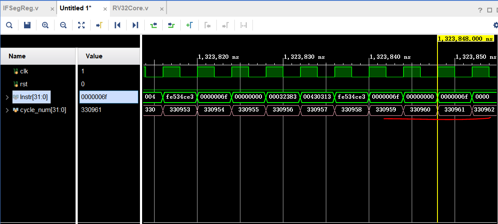
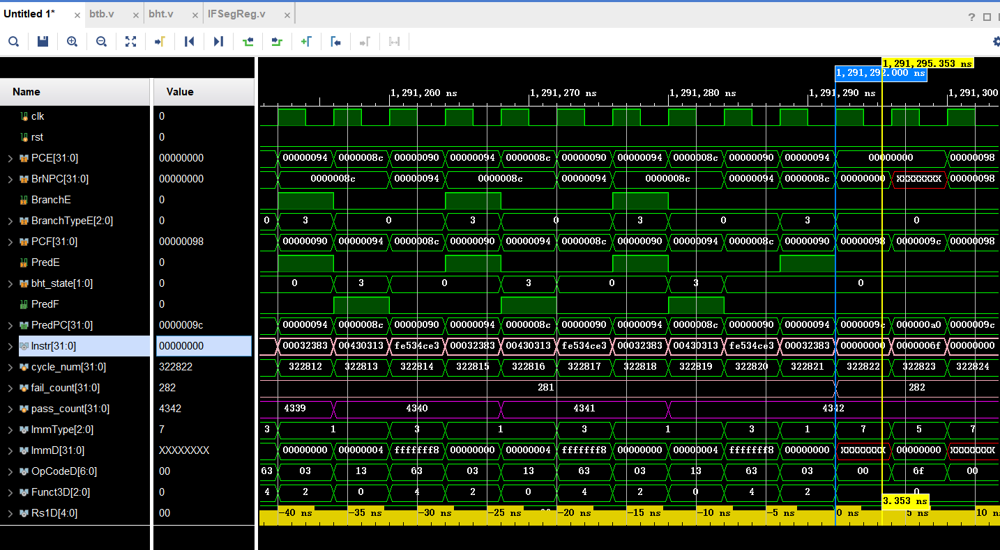

# 体系结构 lab4

## BTB 

btb.v 实现整体模块

NPC_Generator.v 根据控制信号修改下条指令的地址： PC_In

HazardUnit.v  BranchE != PredE 分支预测错误，清空 ID,EX 段

IDSegReg.v：传递 PredF -> PredD

EXSegReg.v：传递 PredD -> PredE

RV32Core.v：连接数据通路

## BTH

bht.v 实现状态机，bht_state 作为状态信号导出

btb.v 连接 bht 状态机，将 bht_state 作为状态信号导入

RV32Core.v：连接数据通路

## 完成表格

Branch History Table (BHT)

| BTB  | BHT  | REAL | NPC_PRED | flush | NPC_REAL | BTB_UPADTE |
| ---- | ---- | ---- | -------- | ----- | -------- | ---------- |
| Y    | Y    | Y    | BUF      | N     | BUF      | N          |
| Y    | Y    | N    | BUF      | Y     | PC_EX+4  | N          |
| Y    | N    | Y    | PC_IF+4  | Y     | BUF      | N          |
| Y    | N    | N    | PC_IF+4  | N     | PC_EX+4  | N          |
| N    | Y    | Y    | PC_IF+4  | Y     | BrNPC    | Y          |
| N    | Y    | N    | PC_IF+4  | N     | PC_EX+4  | N          |
| N    | N    | Y    | PC_IF+4  | Y     | BrNPC    | Y          |
| N    | N    | N    | PC_IF+4  | N     | PC_EX+4  | N          |

NPC_PRED：当且仅当 BTB 和 BHT 都预测跳转时，才会从 BUFF 中取指令的地址。

flush：当实际跳转结果和预测跳转结果不同时，flush ID 和 EX 段寄存器。

NPC_REAL：

- 当 BTB 命中且 EX 段确实有跳转时，实际的 NPC 可以来自 BUFF；
- 若 BTB 中未命中，但 EX 段有跳转，此时 NPC_REAL 应该为流水线计算出的实际跳转地址 BrNPC；
- 其余情况均为 PC_EX+4

BTB_UPDATE：只有在 BTB 未命中但 EX 段确实有跳转的情况下，才会更新 BTB。

## 实验结果分析

假定在所执行的代码中，一共执行 n 次分支指令，分支预测命中可以带来 2 个时钟周期的收益（ID 和 EX 段寄存器不需要 flush），预测失败没有收益。

无分支预测的情况下，分支代价为 2 个时钟周期。

假定分支预测成功的概率为 a，则总收益为 $T = n*a*2$

**btb.S, bht.S, qsort256.S, matmul16.S 四个测试文件的统计结果如下：**

包括

1. 未使用分支预测和使用分支预测的总周期数及差值

    > 在 IFSegReg 模块中设置 cycle_num 变量计数。
    >
    > btb.S 和 bht.S 都是直到 Instr 取不出来，变为 xxxxxxxx 为止；
    >
    > qsort 和 matmul 最后会陷入跳转循环，计数到第一个循环开始为止；

2. 分支指令数目，动态分支预测正确及错误次数

    > 分支指令数目 =  分支预测错误次数 + 分支预测正确次数

### btb.S

|       | 无分支预测执行周期数 | 有分支预测执行周期数 | 差值 | 分支指令数 | 预测失败数 | 预测成功数 |
| ----- | -------------------- | -------------------- | ---- | ---------- | ---------- | ---------- |
| 1 bit | 508                  | 311                  | 197  | 101        | 2          | 99         |
| 2 bit | 508                  | 313                  | 195  | 101        | 3          | 98         |

### bht.S

|       | 无分支预测执行周期数 | 有分支预测执行周期数 | 差值 | 分支指令数 | 预测失败数 | 预测成功数 |
| ----- | -------------------- | -------------------- | ---- | ---------- | ---------- | ---------- |
| 1 bit | 534                  | 380                  | 154  | 110        | 22         | 88         |
| 2 bit | 534                  | 366                  | 168  | 110        | 15         | 95         |

### qsort256.S

|       | 无分支预测执行周期数 | 有分支预测执行周期数 | 差值 | 分支指令数 | 预测失败数 | 预测成功数 |
| ----- | -------------------- | -------------------- | ---- | ---------- | ---------- | ---------- |
| 1 bit | 57980                | 58277                | -297 | 8602       | 3401       | 5201       |
| 2 bit | 57980                | 56761                | 1219 | 8602       | 1847       | 6755       |

### matmul16.S

|       | 无分支预测执行周期数 | 有分支预测执行周期数 | 差值 | 分支指令数 | 预测失败数 | 预测成功数 |
| ----- | -------------------- | -------------------- | ---- | ---------- | ---------- | ---------- |
| 1 bit | 330959               | 323354               | 7605 | 4624       | 548        | 4076       |
| 2 bit | 330959               | 322822               | 8137 | 4624       | 282        | 4342       |

仿真截图举例：

无分支预测 matmul16.S 

有分支预测 matmul16.S btb 策略

  

**Q：对比不同策略分析上述表格中几点的关系。**

A：

（1）除了 btb.S 之外，在其他所有测试样例中，使用 btb+bht 策略的分支预测正确率都要高于只使用 btb 策略，又因为 btb+bht 策略的分支预测正确指令数多，故而在该策略下的执行周期数少于只使用 btb 策略。

（2）除了在 btb 策略下的 qsort256 程序之外，其他所有测试情况中，动态分支预测的指令执行周期数都要小于无动态分支预测的情况，另外，结合第（1）点，使用 bht+btb 策略的指令执行周期数在大部分情况下少于只使用 btb 策略。