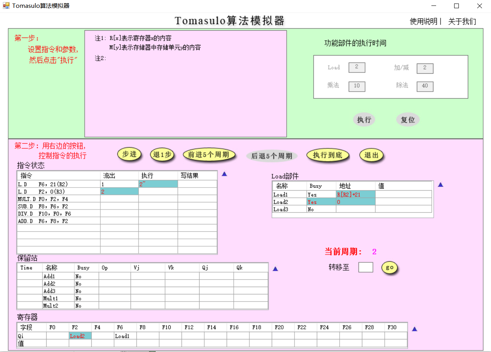
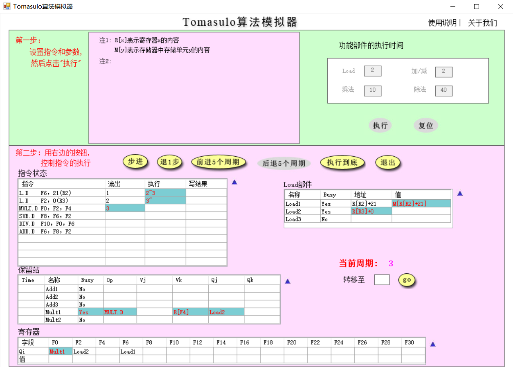
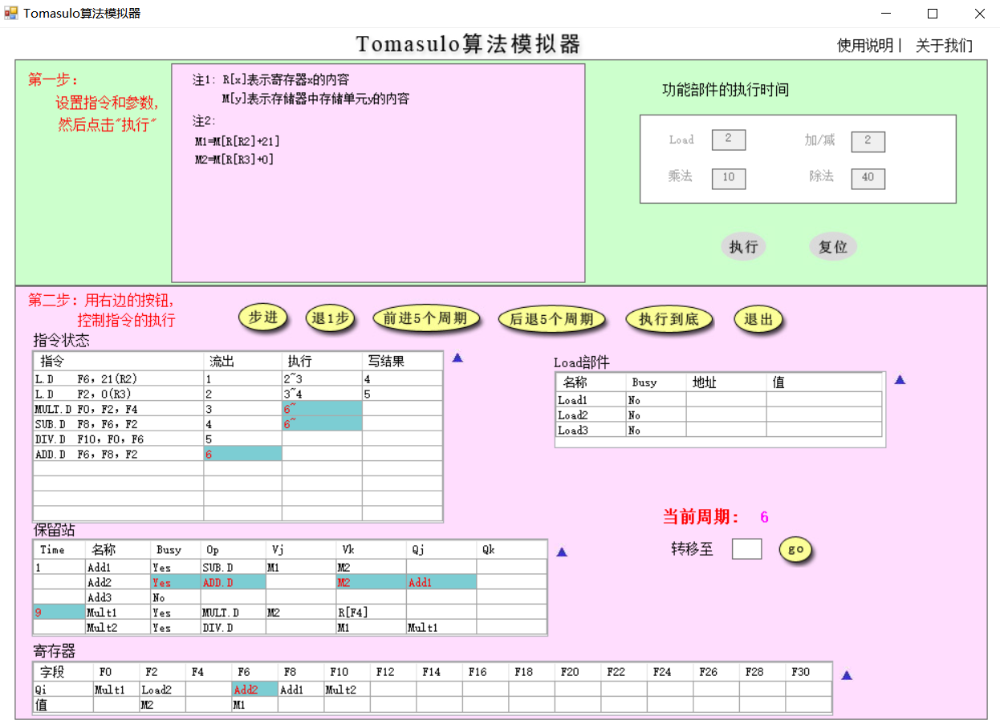
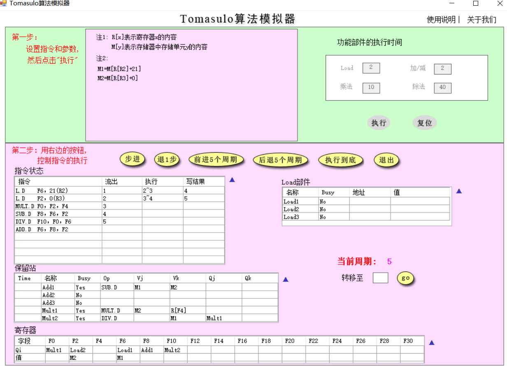
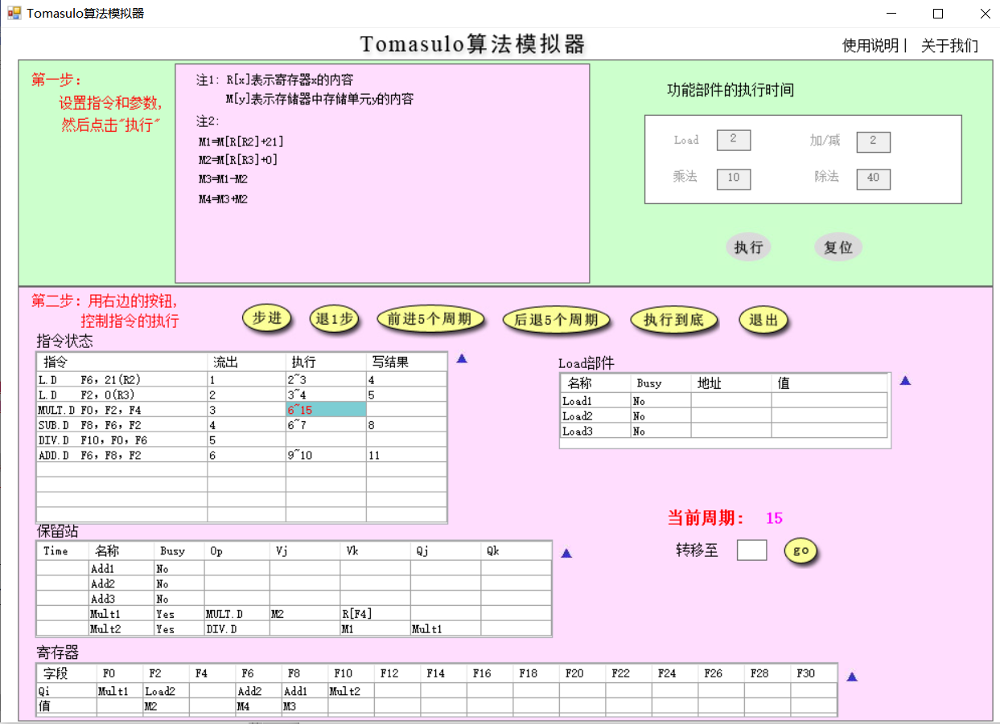
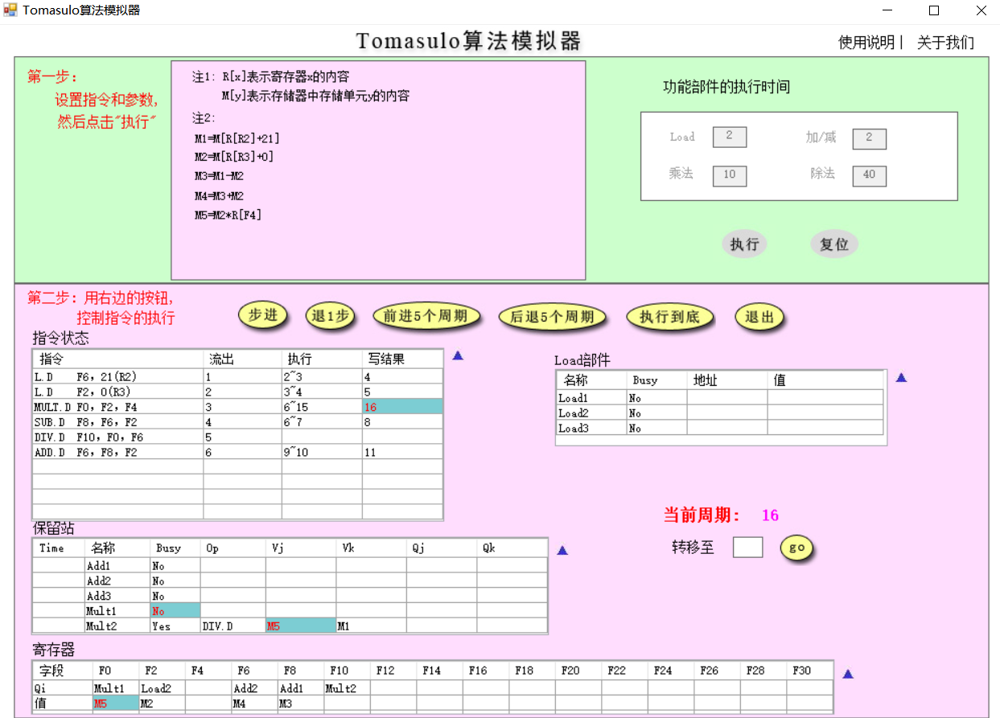
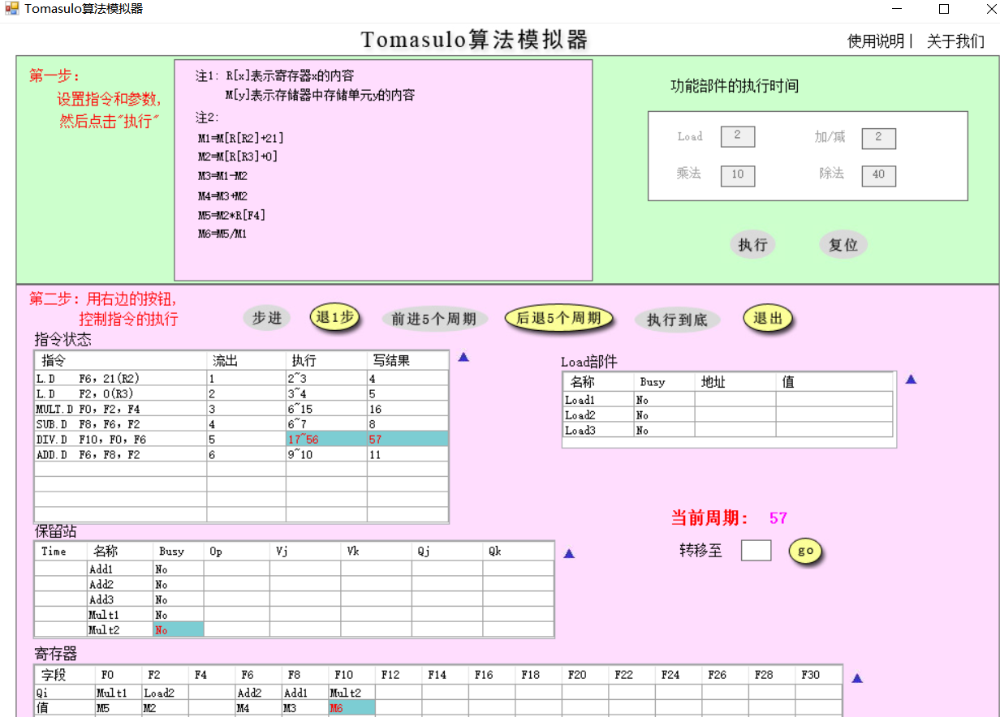
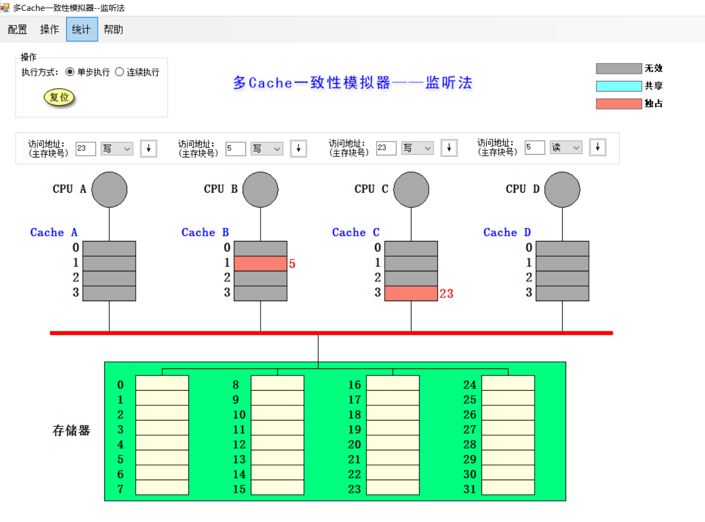
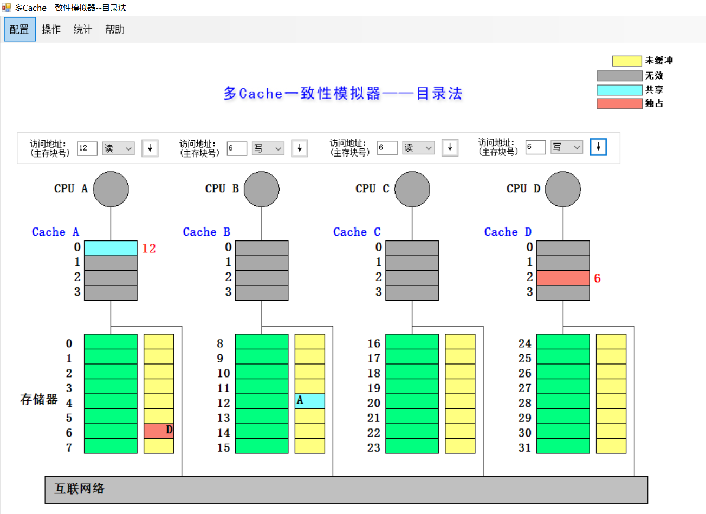

# 体系结构lab5

> PB18111707 吕瑞
>
> 2021/6/18

## Tomasulo 算法模拟器

1. **分别截图（当前周期2和当前周期3），请简要说明 load 部件做了什么改动。**

    周期2：

    周期3：

    Load1：更新访存取值

    Load2：更新访存地址

    

2. **请截图（MUL.D 刚开始执行时系统状态），并说明该周期相比上一周期整个系统发生了哪些改动（指令状态、保留站、寄存器和 Load 部件）**

    MUL.D 开始时系统的执行状态：

    上一个时钟周期整个系统的状态：

    指令状态：

    - ADD.D 指令发射；
    - `L.D F2,0(R3)` 指令写结束；
    - MULT.D 指令开始执行；
    - SUBD.D 指令开始执行；

    保留站：

    - Mult1 部件的 Time 变为 9；
    - Add2 部件的 Busy 变为 Yes，Op 变为 ADD.D，Vk 为 M2，Qj 为 Add1

    寄存器：

    - F6 的 Q6 从 Load1 变为 Add2；

    Load 部件：无变化；

    

3. **简要说明是什么相关导致 MUL.D 流出后没有立即执行。**

    ANS：`L.D F2,0(R3)` 和 `MUL.D F0,F2,F4` 之间存在 RAW 数据相关（F2 寄存器）。

    

4. **请分别截图（15 周期和 16 周期的系统状态），并分析系统发生了哪些变化。**

    周期 15：

    周期16：

    指令状态：MULT.D 指令写结束；

    保留站：

    - Mult2 部件 Vj 变为 M5，Qj 清空；
    - Mut1 部件 Busy 变为 No，Op，Vj，Vk 清空；

     寄存器：F0 中写入 M5；

5. 回答所有指令刚刚执行完毕时是第多少周期，同时请截图（最后一条指令写 CBD 时认为指令流执行结束）

    在第 57 个时钟周期时，指令执行完毕：

    

## 多 cache 一致性算法 - 监听法

1. **利用模拟器进行下述操作，并填写下表**

    | 所进行的访问   | 是否发生了替换？ | 是否发生了写回？ | 监听协议进行的操作与块状态改变                               |
    | -------------- | ---------------- | ---------------- | ------------------------------------------------------------ |
    | CPU A 读第 5块 | 否               | 否               | 存储器的第 5 块存入 Cache A 的第 1 块，并将数据送往 CPU A    |
    | CPU B 读第 5块 | 否               | 否               | 存储器第 5 块存入 Cache B 的第 1 块，并将数据送往 CPU B      |
    | CPU C 读第 5块 | 否               | 否               | 存储器第 5 块存入 Cache C 的第 1 块，并将数据送往 CPU C      |
    | CPU B 写第 5块 | 否               | 否               | 写命中 CPU B Cache 第一块，设为独占，将新数据写入，CPU A 与 CPU C cache 第一块作废 |
    | CPU D 读第 5块 | 否               | 是               | Cache B 将第一块写回存储器的第 5 块，设为共享；存储器第 5 块存入 Cache D 的第 1 块，并将数据送往 CPU D |
    | CPU B 写第21块 | 是               | 否               | 写 CPU B Cache 第一块不命中，取存储器第 21 块到 CPU B Cache 第一块，设为独占，CPU B 写入Cache第一块 |
    | CPU A 写第23块 | 否               | 否               | 写 CPU A Cache 第 3 块不命中，取存储器第 23 块到 CPU A Cache 第三块，设为独占，CPU A 写入Cache 第三块 |
    | CPU C 写第23块 | 否               | 否               | CPU A Cache 第 3 块写回存储器第 23 块，存储器第 23 块取⾄ CPU C Cache 第 3 块，设为独占，CPU C 写⼊ Cache 的第 3 块，Cache A 的第 3 块作废 |
    | CPU B 读第29块 | 是               | 是               | CPU B Cahce 第 1 块写回存储器第 21 块，存储器第 29 块取⾄ CPU B Cache 的第 1 块，设为共享，数据最终将送⾄ CPU B |
    | CPU B 写第5块  | 是               | 否               | 写 CPU B Cache 第一块不命中，取存储器第 5 块到 CPU B Cache 第一块，设为独占，CPU B 写入 Cache 第一块 |

2.  执行操作过后的 cache 系统状态：

## 多 cache 一致性算法 - 目录法

1. 利用模拟器进行下述操作，并填写下表：

    | 所进行的访问   | 监听协议进行的操作与块状态改变                               |
    | -------------- | ------------------------------------------------------------ |
    | CPU A 读第6块  | Cache A 读第 2 块不命中，向宿主结点存储器第 6 块发送读不命中 (A, 6) 消息，宿主把数据块传给本地节点 Cache 第 2 块，共享集合设为 {A}，块被送到 CPU A |
    | CPU B读第6块   | Cache B 读第 2 块不命中，向宿主结点发送读不命中 (B,6) 消息，宿主找到第 6 块数据，并将数据块发送给 Cache B，共享集合设置为 {A,B}，数据块最终被送给 CPU B |
    | CPU D 读第6块  | Cache D 读第 2 块不命中，向宿主结点发送读不命中 (D,6) 消息，宿主找到第 6 块数据，并将数据块发送给 Cache D，共享集合设置为 {A,B,D}，数据块最终被送给 CPU D |
    | CPU B 写第6块  | Cache B 命中第 2 块，向宿主结点发送写命中 (B,6) 消息，宿主向远程结点 A、D 分别发送作废（6）消息，共享集合设为 {B}，CPU B 向 Cache B 的第 2 块写入新数据 |
    | CPU C 读第6块  | Cache C 读第 2 块不命中，向宿主结点发送读不命中 (C,6) 消息，宿主给远程结点发送取数据块（6）的消息，Cache B 将第 2 块数据发送给宿主结点，宿主把刚得到的数据块发送给 Cache C，共享集合设置为 {B,C}，数据块最终被送给 CPU C |
    | CPU D写第20块  | Cache D 写第 0 块不命中，向宿主结点存储器第 20 块发送写不命中(D, 20)消息，宿主把数据块送给 Cache D 第 0 块，共享集合设置为 {D}, CPU D 将新数据写入 Cache D 的第 0 块 |
    | CPUA写第20块   | Cache A 写第 0 块不命中，向宿主结点存储器第 20 块发送写不命中(A, 20)消息，宿主给 Cache D 发送取并作废（20）的消息，Cache D 将第 0 块数据发送给宿主结点，并将第 0  块数据作废。宿主把数据块送给 Cache A 的第 0 块，共享集合设置为 {A}, CPU A 将新数据写入 Cache A 的第 0 块 |
    | CPU D写第6块   | Cache D 写第 2 块不命中，向宿主结点存储器第 6 块发送写不命中(D, 6)消息，宿主分别向 Cache B、Cache A 发送作废（6）消息，并把数据块送给 Cache D 第 2 块，共享集合设置为 {D}, CPU D 将新数据写入 Cache D 的第 2 块 |
    | CPU A 读第12块 | Caceh A 第 0 块不命中，向被替换块的宿主结点发送写回并修改共享集（A,20）消息并向宿主结点发送读不命中（A,12）消息。宿主把数据块（12）发送给 Cache A 的第 0 个数据块，共享集合设为 {A}，数据块最终被送往 CPU A |

2. **截图，展示执行完以上操作后整个 cache 系统的状态**

    系统状态：

    

## 综合问答

1. **目录法和监听法分别是集中式和基于总线，两者优劣是什么？（言之有理即可）**

    ANS：

    监听法的优势在于，核较少时，总线压力小，cache 一致性的成本低，效率高。其劣势在于，总线的可扩放性受到一定限制：（1）总线上能够连接的处理器数目有限；（2）共享总线存在竞争使用问题；（3）由大量处理器构成的多处理器系统中，监听带宽是瓶颈；（4）在非总线或环的网络上监听是比较困难的，因为必须将一致性相关信息广播到所有处理器，这是比较低效的。

    目录法的优势在于，使用目录来记录每个 cached 块的状态，目录项说明了哪个私有 cache 包含了块的副本，省去了监听法中的广播方式，就能保证 cache coherence，在多核处理器中优势明显。

    其劣势在于，随着核数的增加，目录维护的成本变大。

    

2. **Tomasulo 算法相比 ScoreBoard 算法有什么异同？（简要回答两点：分别解决了什么相关，分别是分布式还是集中式）（参考第五版教材）**

    ANS：

    相同点：两种算法都能解决三种数据相关（RAW,WAR,WAW）。两种算法都是通过动态调度的方式来解决 RAW 冲突。

    不同点：Tomasulo 用重命名（Renaming）技术解决 WAR 和 WAW 相关，比 Score Board 使用插入 Stall 的技术解决更加高效。

    Tomasulo 是分布式，Score Borad 是集中式。

3. **Tomasulo 算法是如何解决结构、RAW、WAR和WAW相关的？（参考第五版教材）**

    ANS：

    结构相关：如果一条指令需要用到其他指令正在使用的资源，则暂停这条指令的发射或执行，等到资源可用为止。

    RAW 相关 - Tomasulo 跟踪指令的每个源操作数，仅当所有源操作数都可用时才执行指令。
    
    WAR 和 WAW 相关 - 使用保留站来重命名寄存器，并在操作数可用时立即将其存储在保留站中。